# Phone Games - Architecture Documentation

## Table of Contents
1. [Overview](#overview)
2. [High-Level Architecture](#high-level-architecture)
3. [Technology Stack](#technology-stack)
4. [Package Structure](#package-structure)
5. [Core Components](#core-components)
6. [Data Model](#data-model)
7. [Communication Flows](#communication-flows)
8. [Design Patterns](#design-patterns)
9. [External Integrations](#external-integrations)

---

## Overview

Phone Games is a multiplayer party game platform built as a **TypeScript monorepo**. It supports real-time gameplay through multiple communication channels including WebSocket, WhatsApp (via Meta Business API), and Twilio.

The platform currently features the **Impostor** game - a social deduction game where players receive words and must identify the impostor who received a different word.

### Key Features
- Multi-channel notifications (WebSocket, WhatsApp, Twilio)
- Real-time game state synchronization
- Multi-language support (English, Spanish)
- Firebase authentication
- QR code party joining

---

## High-Level Architecture

---

## Technology Stack

### Stack Details

| Layer | Technology | Version |
|-------|-----------|---------|
| **Language** | TypeScript | 5.9.2 |
| **Runtime** | Node.js | Latest LTS |
| **Build System** | Turborepo | 2.5.8 |
| **Package Manager** | pnpm | 10.5.0 |
| **Web Framework** | Express | 5.1.0 |
| **ORM** | Prisma | 6.16.2 |
| **Frontend** | React | 18.3.1 |
| **Bundler** | Vite | 5.4.0 |
| **Logging** | Pino | 10.0.0 |
| **Validation** | Zod | 4.1.12 |

---

## Package Structure

### Package Responsibilities

| Package | Purpose |
|---------|---------|
| `@phone-games/db` | Prisma client generation and database schema |
| `@phone-games/errors` | Custom error classes for domain errors |
| `@phone-games/logger` | Structured logging with Pino |
| `@phone-games/games` | Game logic (Impostor game implementation) |
| `@phone-games/repositories` | Data access abstraction layer |
| `@phone-games/user` | User domain service |
| `@phone-games/party` | Party/session management and game orchestration |
| `@phone-games/messaging` | Inbound message parsing and command routing |
| `@phone-games/notifications` | Multi-channel notification delivery |

---

## Core Components

### Session Coordinator (Mediator Pattern)

The `SessionCoordinator` is the central orchestrator that coordinates all party and game operations.

### Notification System

### Game Architecture

### Command System

---

## Data Model

### Enums

---

## Communication Flows

### WhatsApp Message Processing

### WebSocket Real-time Communication

### Party Creation and Game Start

### Impostor Game Round Flow

### User Registration Flow (Messaging Platforms)

---

## Design Patterns

### Pattern Implementations

| Pattern | Implementation | Purpose |
|---------|----------------|---------|
| **Mediator** | `SessionCoordinator` | Orchestrates party, game, and notification services |
| **Factory** | `GameFactory`, `GameCommandFactory` | Creates games and commands dynamically |
| **Template Method** | `Game`, `BaseImpostorFormatter` | Define algorithm structure with customizable steps |
| **Strategy** | `NotificationProvider`, `Parser` | Interchangeable implementations |
| **Command** | `GameCommand` hierarchy | Encapsulate game actions |
| **Repository** | `IUserRepository`, `IPartyRepository` | Abstract data access |
| **Decorator** | `retryNotificationProvider` | Add retry logic transparently |

---

## External Integrations

### Integration Architecture

### Meta WhatsApp Business API

### Firebase Authentication

```mermaid
sequenceDiagram
    participant Client as Web Client
    participant FB as Firebase
    participant Server as Express Server
    participant Admin as Firebase Admin

    Client->>FB: signInWithEmailAndPassword()
    FB-->>Client: User + ID Token

    Client->>Server: Request with Authorization header
    Note right of Client: Authorization: Bearer {idToken}

    Server->>Admin: verifyIdToken(token)
    Admin->>FB: Verify token
    FB-->>Admin: Decoded token
    Admin-->>Server: {uid, email, ...}

    Server->>Server: Attach user to request
    Server-->>Client: Protected resource
```

---

## Deployment Overview

### Environment Variables

| Variable | Purpose |
|----------|---------|
| `DATABASE_URL` | PostgreSQL connection string |
| `PORT` | Server port (default: 4000) |
| `NODE_ENV` | Environment (development/production) |
| `PUBLIC_URL` | Server URL for QR codes |
| `WHATSAPP_API_URL` | Meta API endpoint |
| `WHATSAPP_PHONE_NUMBER_ID` | Meta phone number ID |
| `WHATSAPP_API_TOKEN` | Meta API token |
| `TWILIO_ACCOUNT_SID` | Twilio account SID |
| `TWILIO_AUTH_TOKEN` | Twilio auth token |
| `TWILIO_PHONE_NUMBER` | Twilio phone number |
| `FIREBASE_PROJECT_ID` | Firebase project ID |
| `FIREBASE_PRIVATE_KEY` | Firebase private key |
| `FIREBASE_CLIENT_EMAIL` | Firebase client email |
| `JWT_SECRET` | JWT signing secret |

---

## API Reference

### REST Endpoints Summary

---

## Future Considerations

1. **Scalability**: Game state currently stored in-memory; consider Redis for horizontal scaling
2. **New Games**: Architecture supports adding new games via `GameFactory`
3. **New Channels**: Add notification providers by implementing `NotificationProvider` interface
4. **Analytics**: Consider adding event tracking for game statistics
5. **Rate Limiting**: Add rate limiting for webhook endpoints
