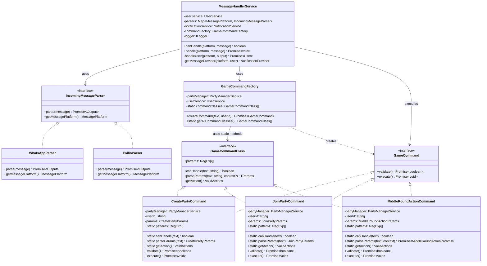
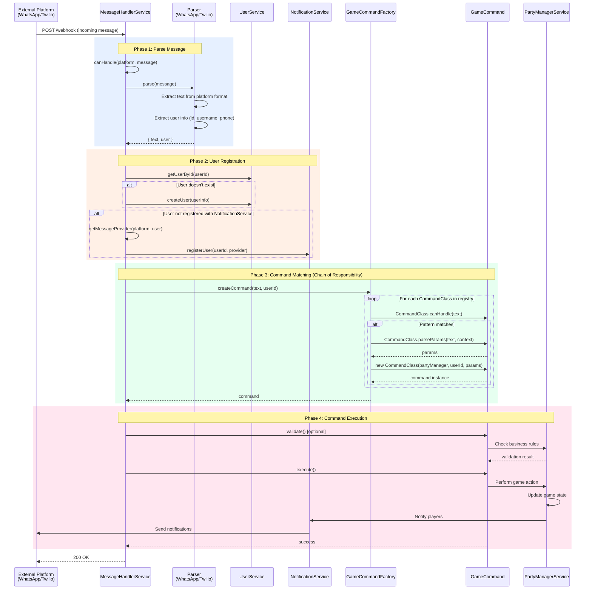

# @phone-games/messaging

Message handling package for the phone-games platform. Processes incoming messages from multiple messaging platforms (WhatsApp, Twilio) and executes game commands using Command Pattern and Chain of Responsibility.

## Architecture

This package implements several design patterns for clean, maintainable message processing:

- **Command Pattern**: Each game action is encapsulated as a command object
- **Chain of Responsibility**: Commands are registered and matched sequentially
- **Strategy Pattern**: Different parsers for different messaging platforms
- **Factory Pattern**: GameCommandFactory creates appropriate command instances

## Key Components

### Parsers
Platform-specific message parsers that extract text and user information from incoming messages.

- `WhatsAppParser`: Handles Meta WhatsApp Business API format
- `TwilioParser`: Handles Twilio WhatsApp format

Parsers have a **single responsibility**: Extract platform-specific data (text + user info). They don't parse commands or match actions.

### Commands
Self-contained command classes that handle specific game actions.

Each command owns:
- Regex patterns for matching (with aliases)
- Parameter parsing logic
- Validation rules
- Execution logic

Available commands:
- `CreatePartyCommand`: Create a new party
- `JoinPartyCommand`: Join an existing party
- `LeavePartyCommand`: Leave current party
- `StartMatchCommand`: Start a match in the party
- `NextRoundCommand`: Progress to next round
- `MiddleRoundActionCommand`: Perform in-game actions (voting, etc.)
- `FinishRoundCommand`: End the current round
- `FinishMatchCommand`: End the match

### Factory
`GameCommandFactory` uses Chain of Responsibility to find the matching command and instantiate it with parsed parameters.

### Message Handler
`MessageHandlerService` orchestrates the entire flow: parse → user registration → command execution.

## Class Diagram



## Sequence Diagram: Message Processing Flow



## Command Matching Flow

```mermaid
sequenceDiagram
    participant Factory as GameCommandFactory
    participant Create as CreatePartyCommand
    participant Join as JoinPartyCommand
    participant Leave as LeavePartyCommand
    participant Other as Other Commands...

    Note over Factory: text = "/create_party impostor MyParty"

    Factory->>Create: canHandle(text)
    Create->>Create: Check patterns:<br/>[/\/create_party/, /\/new_party/, /\/cp/]
    Create-->>Factory: true ✓

    Factory->>Create: parseParams(text, context)
    Create->>Create: Split text: ["", "impostor", "MyParty"]
    Create-->>Factory: { gameName: "impostor", partyName: "MyParty" }

    Factory->>Create: new CreatePartyCommand(partyManager, userId, params)
    Create-->>Factory: command instance

    Note over Factory,Create: Command ready for execution
```

## Usage Example

```typescript
import { MessageHandlerService } from '@phone-games/messaging';
import { WhatsAppParser, TwilioParser } from '@phone-games/messaging';

// Initialize parsers
const parsers = [
  new WhatsAppParser(),
  new TwilioParser()
];

// Create message handler
const messageHandler = new MessageHandlerService(
  notificationService,
  partyManagerService,
  userService,
  parsers,
  logger
);

// Handle incoming webhook
app.post('/webhook/:platform', async (req, res) => {
  const platform = req.params.platform; // 'whatsapp' or 'twilio'
  const message = req.body;

  if (messageHandler.canHandle(platform, message)) {
    await messageHandler.handle(platform, message);
    res.status(200).send('OK');
  } else {
    res.status(400).send('Cannot handle message');
  }
});
```

## Adding New Commands

To add a new command, create a class that implements both `GameCommand` and `GameCommandClass`:

```typescript
export class MyNewCommand implements GameCommand {
  // Static methods for matching and parsing
  static readonly patterns = [
    /\/my_command/,
    /\/mc/  // alias
  ];

  static canHandle(text: string): boolean {
    return this.patterns.some(pattern => pattern.test(text));
  }

  static parseParams(text: string): MyCommandParams {
    const [_action, param1, param2] = text.split(' ');
    return { param1, param2 };
  }

  static getAction(): ValidActions {
    return ValidActions.MY_ACTION;
  }

  // Instance methods for execution
  constructor(
    private partyManager: PartyManagerService,
    private userId: string,
    private params: MyCommandParams
  ) {}

  async validate(): Promise<boolean> {
    // Optional validation logic
    return true;
  }

  async execute(): Promise<void> {
    // Command execution logic
    await this.partyManager.doSomething(this.userId, this.params);
  }
}
```

Then register it in `GameCommandFactory`:

```typescript
private static readonly commandClasses: GameCommandClass[] = [
  CreatePartyCommand,
  JoinPartyCommand,
  // ... other commands
  MyNewCommand,  // Add your command here
];
```

## Design Benefits

### Single Responsibility Principle
- **Parsers**: Only extract platform-specific data
- **Commands**: Only handle specific game actions
- **Factory**: Only create appropriate command instances
- **Handler**: Only orchestrate the flow

### Open/Closed Principle
- Adding new commands doesn't require modifying existing code
- Just create a new command class and register it

### Testability
- Each component can be tested in isolation
- Commands can be tested without parsers
- Parsers can be tested without commands

### Maintainability
- Each command owns its own patterns and parsing logic
- No switch statements or long if/else chains
- Clear separation between platform abstraction and business logic

## Pattern Summary

| Pattern | Where | Why |
|---------|-------|-----|
| **Command Pattern** | Commands | Encapsulate game actions as objects with execute() |
| **Chain of Responsibility** | GameCommandFactory | Find matching command without switch statements |
| **Strategy Pattern** | Parsers | Different parsing strategies for different platforms |
| **Factory Pattern** | GameCommandFactory | Create command instances with dependencies |
| **Template Method** | Commands | Some commands have async parseParams with context |

## Dependencies

- `@phone-games/party`: Party and game management services
- `@phone-games/user`: User management services
- `@phone-games/notifications`: Notification providers
- `@phone-games/games`: Game interfaces and factories
- `@phone-games/errors`: Error types
- `@phone-games/logger`: Logging interface
