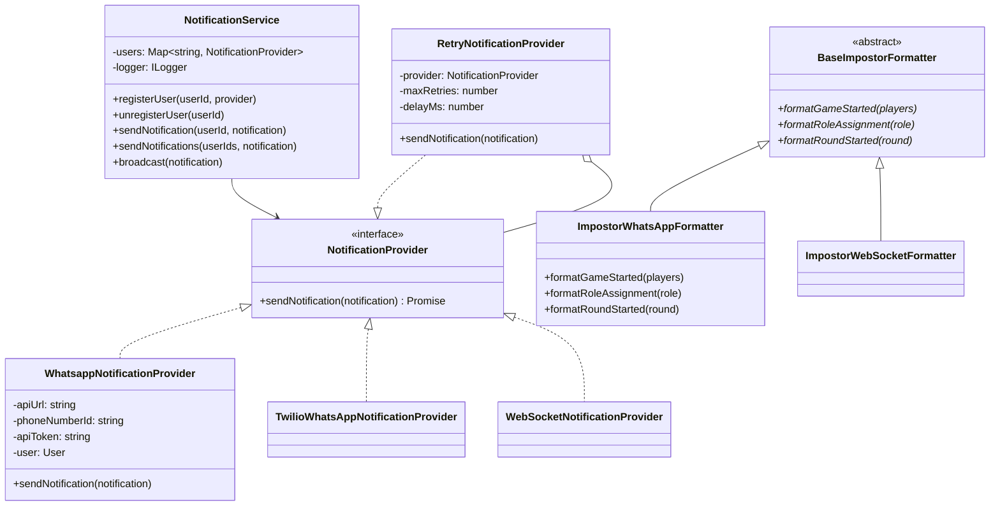

# @phone-games/notifications

Notification delivery package with multi-platform support for the phone-games platform.

## Overview

Provides notification management and delivery across multiple platforms (WhatsApp, WebSocket, Twilio). Implements Strategy Pattern for providers, Decorator Pattern for reliability, and Template Method Pattern for formatters.

## Features

- **Multi-Platform Support**: WhatsApp, Twilio, WebSocket
- **Provider Strategy**: Pluggable notification providers
- **Retry Logic**: Automatic retry with exponential backoff
- **Message Formatting**: Game-specific message formatters
- **User Management**: Register/unregister users per platform
- **Type Safety**: Full TypeScript support

## Architecture

```
NotificationService
    ├── User → NotificationProvider (Strategy)
    │       └── RetryDecorator (Decorator)
    │              └── WhatsApp/Twilio/WebSocket Provider
    └── Formatter (Template Method)
           └── ImpostorFormatter
```

## Design Patterns

### 1. Strategy Pattern - Providers
Different notification delivery strategies:

```typescript
interface NotificationProvider {
  sendNotification(notification: Notification): Promise<void>;
}

class WhatsappNotificationProvider implements NotificationProvider { }
class TwilioWhatsAppNotificationProvider implements NotificationProvider { }
class WebSocketNotificationProvider implements NotificationProvider { }
```

### 2. Decorator Pattern - Retry Logic
Add retry behavior without modifying provider:

```typescript
const baseProvider = new WhatsappNotificationProvider(...);
const reliableProvider = new RetryNotificationProvider(baseProvider, {
  maxRetries: 3,
  delayMs: 1000
});
```

### 3. Template Method Pattern - Formatters
Base formatter defines structure, subclasses implement specifics:

```typescript
abstract class BaseImpostorFormatter {
  abstract formatGameStarted(players): string;
  abstract formatRoundStarted(round): string;
  // ... other methods
}

class ImpostorWhatsAppFormatter extends BaseImpostorFormatter { }
class ImpostorWebSocketFormatter extends BaseImpostorFormatter { }
```

## Usage

### Initialize Service

```typescript
import { NotificationService } from '@phone-games/notifications';
import { Logger } from '@phone-games/logger';

const logger = new Logger({ name: 'notifications' });
const notificationService = new NotificationService(logger);
```

### Register User

```typescript
import {
  WhatsappNotificationProvider,
  RetryNotificationProvider
} from '@phone-games/notifications';

// Create provider for user
const provider = new WhatsappNotificationProvider(
  apiUrl,
  phoneNumberId,
  apiToken,
  user
);

// Add retry logic
const reliableProvider = new RetryNotificationProvider(provider, {
  maxRetries: 3,
  delayMs: 1000
});

// Register user
await notificationService.registerUser(userId, reliableProvider);
```

### Send Notifications

```typescript
// Send to specific user
await notificationService.sendNotification(userId, {
  message: 'Game started! You are the impostor.',
  type: 'game_event'
});

// Send to multiple users
await notificationService.sendNotifications(
  [userId1, userId2, userId3],
  {
    message: 'Round 1 has started. Cast your votes!',
    type: 'game_event'
  }
);

// Send to all registered users
await notificationService.broadcast({
  message: 'Server maintenance in 5 minutes',
  type: 'system'
});
```

### Unregister User

```typescript
await notificationService.unregisterUser(userId);
```

## Notification Providers

### WhatsApp (Meta Business API)

```typescript
import { WhatsappNotificationProvider } from '@phone-games/notifications';

const provider = new WhatsappNotificationProvider(
  'https://graph.facebook.com/v17.0',  // API URL
  'phone-number-id',                   // WhatsApp Business phone number ID
  'api-token',                         // Access token
  user                                 // User to send to
);

await provider.sendNotification({
  message: 'Hello from WhatsApp!',
  type: 'text'
});
```

### Twilio WhatsApp

```typescript
import { TwilioWhatsAppNotificationProvider } from '@phone-games/notifications';

const provider = new TwilioWhatsAppNotificationProvider(
  'account-sid',           // Twilio account SID
  'auth-token',            // Twilio auth token
  'whatsapp:+1234567890',  // From number (Twilio WhatsApp)
  user                     // User to send to
);

await provider.sendNotification({
  message: 'Hello from Twilio!',
  type: 'text'
});
```

### WebSocket

```typescript
import { WebSocketNotificationProvider } from '@phone-games/notifications';

const provider = new WebSocketNotificationProvider(
  webSocketServer,  // WebSocket server instance
  user              // User to send to
);

await provider.sendNotification({
  message: JSON.stringify({ event: 'game_update', data: {} }),
  type: 'json'
});
```

## Retry Decorator

Adds automatic retry with exponential backoff:

```typescript
import { RetryNotificationProvider } from '@phone-games/notifications';

const baseProvider = new WhatsappNotificationProvider(...);

const retryProvider = new RetryNotificationProvider(baseProvider, {
  maxRetries: 3,     // Retry up to 3 times
  delayMs: 1000      // Initial delay: 1 second
});

// Automatically retries on failure with delays: 1s, 2s, 4s
await retryProvider.sendNotification(notification);
```

## Message Formatters

### Impostor Game Formatters

Format game events for different platforms:

```typescript
import {
  ImpostorWhatsAppFormatter,
  ImpostorWebSocketFormatter
} from '@phone-games/notifications';

const whatsappFormatter = new ImpostorWhatsAppFormatter();
const websocketFormatter = new ImpostorWebSocketFormatter();

// Format game started message
const whatsappMsg = whatsappFormatter.formatGameStarted(players);
// "🎮 Game Started!\n\nPlayers:\n• Alice\n• Bob\n• Charlie"

const websocketMsg = websocketFormatter.formatGameStarted(players);
// { type: 'game_started', players: ['Alice', 'Bob', 'Charlie'] }

// Format role assignment
const roleMsg = whatsappFormatter.formatRoleAssignment('impostor');
// "🎭 Your Role: IMPOSTOR\n\nYou are the impostor! Deceive others without being caught."

// Format round started
const roundMsg = whatsappFormatter.formatRoundStarted(2);
// "🔄 Round 2\n\nDiscussion phase. Vote for who you think is the impostor."
```

### Available Formatter Methods

```typescript
interface ImpostorFormatter {
  formatGameStarted(players: string[]): string;
  formatRoleAssignment(role: 'impostor' | 'regular'): string;
  formatRoundStarted(round: number): string;
  formatVotingPhase(): string;
  formatPlayerEliminated(player: string, role: string): string;
  formatGameEnded(winner: string): string;
}
```

## Error Handling

```typescript
import { ExternalServiceError } from '@phone-games/errors';

try {
  await notificationService.sendNotification(userId, notification);
} catch (error) {
  if (error instanceof ExternalServiceError) {
    logger.error('Failed to send notification', error);
    // Handle gracefully - maybe queue for retry
  } else {
    throw error;
  }
}
```

## Integration Example

### With Party Service

```typescript
import { NotificationService } from '@phone-games/notifications';
import { PartyNotificationCoordinator } from '@phone-games/party';

class PartyNotificationCoordinator {
  constructor(
    private notificationService: NotificationService,
    private partyRepository: IPartyRepository,
    private logger: ILogger
  ) {}

  async notifyGameStarted(partyId: string): Promise<void> {
    const party = await this.partyRepository.findById(partyId);
    if (!party) return;

    const formatter = new ImpostorWhatsAppFormatter();
    const message = formatter.formatGameStarted(
      party.players.map(p => p.username)
    );

    await this.notificationService.sendNotifications(
      party.players.map(p => p.id),
      { message, type: 'game_event' }
    );
  }
}
```

## Best Practices

### 1. Always Use Retry Decorator

```typescript
// ✅ Good - with retry
const provider = new RetryNotificationProvider(
  new WhatsappNotificationProvider(...),
  { maxRetries: 3, delayMs: 1000 }
);

// ❌ Bad - no retry, single point of failure
const provider = new WhatsappNotificationProvider(...);
```

### 2. Handle Provider Failures Gracefully

```typescript
// ✅ Good - log and continue
try {
  await notificationService.sendNotification(userId, notification);
} catch (error) {
  logger.error('Notification failed', error, { userId });
  // Continue - don't crash the app
}

// ❌ Bad - crash on notification failure
await notificationService.sendNotification(userId, notification);
```

### 3. Use Appropriate Formatters

```typescript
// ✅ Good - platform-specific formatter
const formatter = user.platform === 'whatsapp'
  ? new ImpostorWhatsAppFormatter()
  : new ImpostorWebSocketFormatter();

const message = formatter.formatGameStarted(players);
```

### 4. Batch Notifications

```typescript
// ✅ Good - batch send
await notificationService.sendNotifications(userIds, notification);

// ❌ Bad - send individually
for (const userId of userIds) {
  await notificationService.sendNotification(userId, notification);
}
```

## Class Diagram



## Dependencies

- `@phone-games/db`: User types
- `@phone-games/errors`: Error types
- `@phone-games/logger`: Logging interface
- `axios`: HTTP requests for WhatsApp API
- `twilio`: Twilio SDK
- `ws`: WebSocket library

## Related Packages

- `@phone-games/messaging`: Registers users for notifications
- `@phone-games/party`: Sends game notifications to players
- `@phone-games/games`: Provides game events to format
