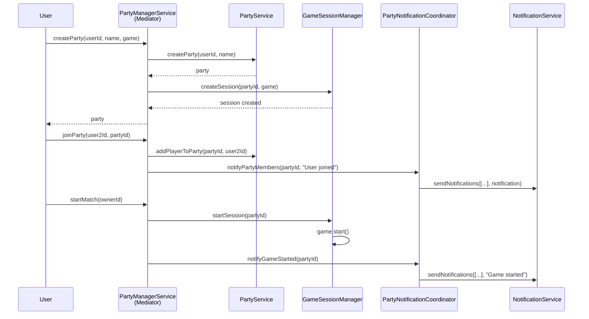

# @phone-games/party

Party and game session management package for the phone-games platform.

## Overview

Manages game parties (lobbies), game sessions, and player coordination. Implements Mediator Pattern for service coordination and Strategy Pattern for game state storage.

## Features

- **Party Management**: Create, join, leave parties
- **Game Session Orchestration**: Start, manage, finish game matches
- **Player Notifications**: Coordinate notifications to all party members
- **State Management**: Pluggable storage strategies (in-memory, Redis, etc.)
- **Mediator Pattern**: Centralized coordination between services

## Architecture

```
PartyManagerService (Mediator)
    ├── PartyService (Party lifecycle)
    ├── GameSessionManager (Game orchestration)
    └── PartyNotificationCoordinator (Player notifications)
```

### Design Pattern: Mediator

`PartyManagerService` acts as a mediator, coordinating between:
- **PartyService**: Manages party data (create, join, leave)
- **GameSessionManager**: Orchestrates game logic
- **PartyNotificationCoordinator**: Sends notifications to players

This prevents tight coupling between components and centralizes control flow.

## Components

### 1. PartyManagerService (Mediator)

Central coordinator for all party operations:

```typescript
class PartyManagerService {
  constructor(
    private partyService: PartyService,
    private gameSessionManager: GameSessionManager,
    private notificationCoordinator: PartyNotificationCoordinator,
    private logger: ILogger
  ) {}

  // Party operations
  async createParty(userId: string, partyName: string, game: IGame): Promise<Party>;
  async joinParty(userId: string, partyId: string): Promise<void>;
  async leaveParty(userId: string): Promise<void>;

  // Game operations
  async startMatch(userId: string): Promise<void>;
  async nextRound(userId: string, params: NextRoundParams): Promise<void>;
  async middleRoundAction(userId: string, params: MiddleRoundActionParams): Promise<void>;
  async finishRound(userId: string, params: FinishRoundParams): Promise<void>;
  async finishMatch(userId: string): Promise<void>;
}
```

### 2. PartyService

Manages party lifecycle and data:

```typescript
class PartyService {
  constructor(
    private partyRepository: IPartyRepository,
    private logger: ILogger
  ) {}

  async createParty(ownerId: string, name: string): Promise<Party>;
  async findPartyById(partyId: string): Promise<Party | null>;
  async findPartyByUserId(userId: string): Promise<Party | null>;
  async addPlayerToParty(partyId: string, userId: string): Promise<void>;
  async removePlayerFromParty(partyId: string, userId: string): Promise<void>;
  async deleteParty(partyId: string): Promise<void>;
}
```

### 3. GameSessionManager

Orchestrates game logic:

```typescript
class GameSessionManager {
  constructor(
    private gameStateStorage: IGameStateStorage,
    private logger: ILogger
  ) {}

  async createSession(partyId: string, game: IGame): Promise<void>;
  async startSession(partyId: string): Promise<void>;
  async executeNextRound(partyId: string, params: NextRoundParams): Promise<NextRoundResult>;
  async executeMiddleRoundAction(partyId: string, params: MiddleRoundActionParams): Promise<MiddleRoundActionResult>;
  async executeFinishRound(partyId: string, params: FinishRoundParams): Promise<FinishRoundResult>;
  async finishSession(partyId: string): Promise<void>;
  async getGameState(partyId: string): Promise<GameState>;
}
```

### 4. PartyNotificationCoordinator

Sends notifications to all party members:

```typescript
class PartyNotificationCoordinator {
  constructor(
    private notificationService: NotificationService,
    private partyRepository: IPartyRepository,
    private logger: ILogger
  ) {}

  async notifyPartyMembers(partyId: string, notification: Notification): Promise<void>;
  async notifyGameStarted(partyId: string): Promise<void>;
  async notifyRoundStarted(partyId: string, round: number): Promise<void>;
  async notifyPlayerEliminated(partyId: string, playerId: string): Promise<void>;
  async notifyGameEnded(partyId: string, winner: string): Promise<void>;
}
```

## Usage

### Create and Join Party

```typescript
import { PartyManagerService } from '@phone-games/party';
import { GameFactory, GAME_NAMES } from '@phone-games/games';

const partyManager = new PartyManagerService(
  partyService,
  gameSessionManager,
  notificationCoordinator,
  logger
);

// User creates a party
const game = GameFactory.createGame(GAME_NAMES.IMPOSTOR);
const party = await partyManager.createParty(
  userId,
  'My Awesome Party',
  game
);

// Other users join
await partyManager.joinParty(user2Id, party.id);
await partyManager.joinParty(user3Id, party.id);
await partyManager.joinParty(user4Id, party.id);
```

### Start and Play Game

```typescript
// Party owner starts the match
await partyManager.startMatch(ownerId);
// → Assigns roles, notifies all players

// Manager progresses to next round
await partyManager.nextRound(ownerId, { userId: ownerId });
// → Starts new round, notifies players

// Players vote
await partyManager.middleRoundAction(user1Id, {
  votes: { [user1Id]: user3Id }
});
await partyManager.middleRoundAction(user2Id, {
  votes: { [user2Id]: user3Id }
});

// Manager finishes round
await partyManager.finishRound(ownerId, {});
// → Tallies votes, eliminates player, checks win condition

// If game not finished, continue with nextRound...

// When game ends
await partyManager.finishMatch(ownerId);
// → Cleans up game session, notifies winner
```

### Leave Party

```typescript
// Player leaves
await partyManager.leaveParty(userId);

// If owner leaves, party is deleted
await partyManager.leaveParty(ownerId);
```

## Game State Storage

### Strategy Pattern

Different storage strategies for game state:

```typescript
interface IGameStateStorage {
  save(partyId: string, state: GameState): Promise<void>;
  load(partyId: string): Promise<GameState | null>;
  delete(partyId: string): Promise<void>;
  exists(partyId: string): Promise<boolean>;
}
```

### Implementations

#### In-Memory Storage (Development)

```typescript
import { InMemoryGameStateStorage } from '@phone-games/party';

const storage = new InMemoryGameStateStorage();
// Fast, but lost on restart
```

#### Redis Storage (Production)

```typescript
import { RedisGameStateStorage } from '@phone-games/party';

const storage = new RedisGameStateStorage(redisClient);
// Persistent, distributed
```

### Usage

```typescript
const gameSessionManager = new GameSessionManager(
  storage,  // Inject storage strategy
  logger
);
```

## Sequence Diagram: Create Party and Start Game



## Error Handling

```typescript
import {
  PartyNotFoundError,
  InvalidGameStateError,
  UnauthorizedError
} from '@phone-games/errors';

try {
  await partyManager.startMatch(userId);
} catch (error) {
  if (error instanceof PartyNotFoundError) {
    // User not in a party
    console.error('You must be in a party to start a match');
  } else if (error instanceof UnauthorizedError) {
    // User is not the party owner
    console.error('Only the party owner can start the match');
  } else if (error instanceof InvalidGameStateError) {
    // Game already started or not enough players
    console.error('Cannot start match in current state');
  } else {
    throw error;
  }
}
```

## Validation

### Business Rules

The package enforces game rules:

```typescript
// Minimum players required
if (party.players.length < game.minPlayers) {
  throw new ValidationError('Not enough players');
}

// Only owner can start match
if (userId !== party.ownerId) {
  throw new UnauthorizedError('Only party owner can start match');
}

// Cannot join if game in progress
if (gameState.currentRound > 0) {
  throw new InvalidGameStateError('Cannot join game in progress');
}
```

## Integration Example

### With Messaging Service

```typescript
import { PartyManagerService } from '@phone-games/party';
import { MessageHandlerService } from '@phone-games/messaging';

// Commands use PartyManagerService
class StartMatchCommand implements GameCommand {
  constructor(
    private partyManager: PartyManagerService,
    private userId: string
  ) {}

  async execute(): Promise<void> {
    await this.partyManager.startMatch(this.userId);
  }
}
```

## Benefits of Mediator Pattern

### Before (Tight Coupling)

```
PartyService ←→ GameSessionManager ←→ NotificationService
      ↑                ↑                      ↑
      └────────────────┴──────────────────────┘
         All components know about each other
```

### After (Mediator Pattern)

```
            PartyManagerService (Mediator)
                 ↙      ↓      ↘
    PartyService  GameSessionManager  NotificationCoordinator

    Components only know about the mediator
```

**Benefits:**
- **Single Responsibility**: Each service has one clear job
- **Loose Coupling**: Services don't depend on each other
- **Easy Testing**: Mock the mediator instead of all services
- **Centralized Control**: All coordination logic in one place

## Best Practices

### 1. Use Mediator for Coordination

```typescript
// ✅ Good - use mediator
await partyManager.startMatch(userId);

// ❌ Bad - coordinate manually
const party = await partyService.findPartyByUserId(userId);
const game = await gameSessionManager.getGameState(party.id);
await gameSessionManager.startSession(party.id);
await notificationCoordinator.notifyGameStarted(party.id);
```

### 2. Validate Ownership

```typescript
// ✅ Good - check authorization
const party = await partyService.findPartyByUserId(userId);
if (party.ownerId !== userId) {
  throw new UnauthorizedError('Only owner can perform this action');
}

// ❌ Bad - no authorization check
await gameSessionManager.startSession(partyId);
```

### 3. Handle State Transitions

```typescript
// ✅ Good - check game state
if (gameState.isFinished) {
  throw new InvalidGameStateError('Game already finished');
}
if (gameState.currentRound === 0) {
  throw new InvalidGameStateError('Game not started');
}

// ❌ Bad - assume valid state
await gameSessionManager.executeNextRound(partyId, params);
```

## Dependencies

- `@phone-games/games`: Game interfaces and implementations
- `@phone-games/repositories`: Party repository
- `@phone-games/notifications`: Notification service
- `@phone-games/db`: Party and User types
- `@phone-games/errors`: Error types
- `@phone-games/logger`: Logging interface

## Related Packages

- `@phone-games/messaging`: Triggers party operations via commands
- `@phone-games/games`: Provides game logic
- `@phone-games/notifications`: Sends updates to players
- `@phone-games/user`: Validates user existence
